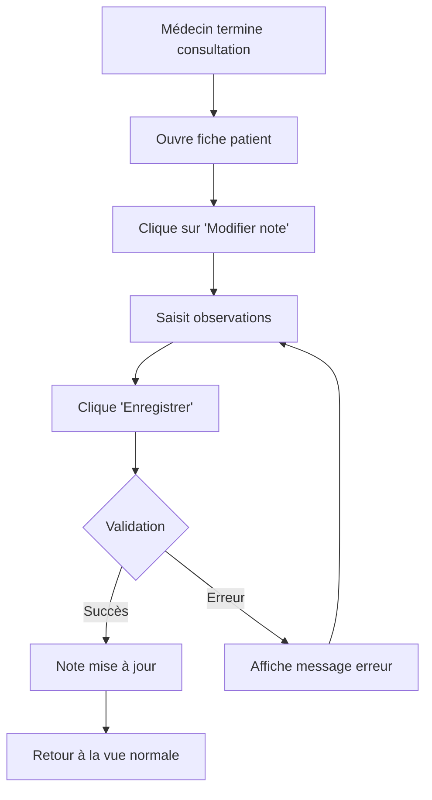

# API : Modifier la Note d'un Rendez-vous

## 📋 Vue d'ensemble

Nouvel endpoint permettant de **modifier ou ajouter une note** à un rendez-vous existant. Cette fonctionnalité permet aux médecins de mettre à jour les observations et notes cliniques d'une consultation à tout moment.

---

## 🆕 Endpoint

### **PUT** `/medecin/rendez-vous/:rendezVousId/note`

**Description** : Modifie la note d'un rendez-vous existant

**Authentification** : Token JWT requis

---

## 📝 Détails de l'Endpoint

### URL Parameters
| Paramètre | Type | Requis | Description |
|-----------|------|--------|-------------|
| `rendezVousId` | Integer | ✅ Oui | ID du rendez-vous à modifier |

### Headers requis
```json
{
  "Authorization": "Bearer <access_token>",
  "Content-Type": "application/json"
}
```

### Body de la requête
```json
{
  "note": "Patient présente une amélioration significative. Poursuite du traitement prescrit. RDV de contrôle dans 1 mois."
}
```

### Paramètres du Body
| Paramètre | Type | Requis | Description |
|-----------|------|--------|-------------|
| `note` | String | ✅ Oui | Texte de la note (peut être vide pour effacer) |

---

## ✅ Réponse Succès (200 OK)

```json
{
  "message": "Note du rendez-vous modifiée avec succès",
  "rendezVous": {
    "id": 123,
    "date": "2024-11-13T00:00:00.000Z",
    "state": "Completed",
    "note": "Patient présente une amélioration significative. Poursuite du traitement prescrit. RDV de contrôle dans 1 mois.",
    "startTime": "2024-11-13T09:30:00.000Z",
    "endTime": "2024-11-13T10:15:00.000Z",
    "patient": {
      "id": 45,
      "fullName": "Marie Dupont",
      "phoneNumber": "+33612345678"
    }
  }
}
```

### Champs de la réponse
| Champ | Type | Description |
|-------|------|-------------|
| `message` | String | Message de confirmation |
| `rendezVous.id` | Integer | ID du rendez-vous |
| `rendezVous.date` | DateTime | Date du rendez-vous |
| `rendezVous.state` | String | État du rendez-vous |
| `rendezVous.note` | String | Note mise à jour |
| `rendezVous.startTime` | DateTime | Heure de début |
| `rendezVous.endTime` | DateTime | Heure de fin |
| `rendezVous.patient` | Object | Informations du patient |

---

## ❌ Réponses d'Erreur

### 400 - Bad Request (ID manquant)
```json
{
  "message": "Le rendez-vous ID est requis"
}
```

### 404 - Not Found
```json
{
  "message": "Rendez-vous non trouvé ou n'appartient pas à ce médecin"
}
```

### 500 - Internal Server Error
```json
{
  "message": "Erreur lors de la modification de la note",
  "error": "Detailed error message"
}
```

---

## 🔒 Sécurité et Validations

### Vérifications effectuées
1. ✅ **Authentification** : Token JWT valide requis
2. ✅ **Autorisation** : Le rendez-vous doit appartenir au médecin authentifié
3. ✅ **Existence** : Vérification que le rendez-vous existe
4. ✅ **Flexibilité** : Permet d'effacer la note en passant une chaîne vide

### Permissions
- Seul le médecin propriétaire du rendez-vous peut modifier la note
- Aucune restriction sur l'état du rendez-vous (peut modifier même après "Completed")

---

## 🎯 Cas d'Usage

### 1. Ajouter une note après consultation
```javascript
// Ajouter des observations après avoir vu le patient
updateNote(123, "Patient en bonne forme générale. Tension normale 120/80.");
```

### 2. Modifier une note existante
```javascript
// Corriger ou compléter une note précédente
updateNote(123, "MISE À JOUR : Patient a signalé des douleurs abdominales. Prescrit un scanner.");
```

### 3. Effacer une note
```javascript
// Supprimer une note (laisser vide ou null)
updateNote(123, "");
```

### 4. Ajouter des détails après examen
```javascript
// Compléter après réception de résultats
updateNote(123, "Résultats d'analyses reçus : tout est normal. Pas de traitement supplémentaire nécessaire.");
```

---

## 💻 Intégration Frontend

### Exemple React - Édition de Note

```jsx
import React, { useState } from 'react';
import { Edit2, Save, X } from 'lucide-react';

const RendezVousNoteEditor = ({ rendezVous, onUpdate }) => {
  const [isEditing, setIsEditing] = useState(false);
  const [note, setNote] = useState(rendezVous.note || '');
  const [loading, setLoading] = useState(false);
  const [error, setError] = useState(null);

  const handleSave = async () => {
    setLoading(true);
    setError(null);

    try {
      const response = await fetch(
        `http://localhost:3000/medecin/rendez-vous/${rendezVous.id}/note`,
        {
          method: 'PUT',
          headers: {
            'Authorization': `Bearer ${localStorage.getItem('accessToken')}`,
            'Content-Type': 'application/json'
          },
          body: JSON.stringify({ note })
        }
      );

      const data = await response.json();

      if (response.ok) {
        console.log('✅ Note modifiée:', data.message);
        setIsEditing(false);
        
        // Callback pour mettre à jour le parent
        if (onUpdate) {
          onUpdate(data.rendezVous);
        }
      } else {
        setError(data.message);
      }
    } catch (err) {
      setError('Erreur de connexion au serveur');
      console.error('❌ Erreur:', err);
    } finally {
      setLoading(false);
    }
  };

  const handleCancel = () => {
    setNote(rendezVous.note || '');
    setIsEditing(false);
    setError(null);
  };

  return (
    <div className="note-editor">
      <div className="note-header">
        <h3>Notes de Consultation</h3>
        {!isEditing && (
          <button
            onClick={() => setIsEditing(true)}
            className="btn-edit"
          >
            <Edit2 size={16} />
            Modifier
          </button>
        )}
      </div>

      {error && (
        <div className="alert alert-error">
          {error}
        </div>
      )}

      {isEditing ? (
        <div className="note-edit-mode">
          <textarea
            value={note}
            onChange={(e) => setNote(e.target.value)}
            placeholder="Ajoutez vos observations cliniques..."
            rows={6}
            className="note-textarea"
            disabled={loading}
          />
          
          <div className="note-actions">
            <button
              onClick={handleSave}
              disabled={loading}
              className="btn-save"
            >
              <Save size={16} />
              {loading ? 'Enregistrement...' : 'Enregistrer'}
            </button>
            
            <button
              onClick={handleCancel}
              disabled={loading}
              className="btn-cancel"
            >
              <X size={16} />
              Annuler
            </button>
          </div>
        </div>
      ) : (
        <div className="note-display">
          {note ? (
            <p className="note-text">{note}</p>
          ) : (
            <p className="note-empty">Aucune note ajoutée</p>
          )}
        </div>
      )}
    </div>
  );
};

export default RendezVousNoteEditor;
```

### Styles CSS

```css
.note-editor {
  background: white;
  border: 1px solid #e2e8f0;
  border-radius: 8px;
  padding: 20px;
  margin: 16px 0;
}

.note-header {
  display: flex;
  justify-content: space-between;
  align-items: center;
  margin-bottom: 16px;
}

.note-header h3 {
  margin: 0;
  font-size: 18px;
  font-weight: 600;
  color: #1e293b;
}

.btn-edit {
  display: flex;
  align-items: center;
  gap: 8px;
  padding: 8px 16px;
  background: #3b82f6;
  color: white;
  border: none;
  border-radius: 6px;
  cursor: pointer;
  font-size: 14px;
  font-weight: 500;
  transition: background-color 0.2s;
}

.btn-edit:hover {
  background: #2563eb;
}

.alert {
  padding: 12px;
  border-radius: 6px;
  margin-bottom: 12px;
  font-size: 14px;
}

.alert-error {
  background: #fee2e2;
  color: #991b1b;
  border: 1px solid #fecaca;
}

.note-edit-mode {
  display: flex;
  flex-direction: column;
  gap: 12px;
}

.note-textarea {
  width: 100%;
  padding: 12px;
  border: 2px solid #e2e8f0;
  border-radius: 6px;
  font-size: 14px;
  font-family: inherit;
  resize: vertical;
  transition: border-color 0.2s;
}

.note-textarea:focus {
  outline: none;
  border-color: #3b82f6;
}

.note-textarea:disabled {
  background: #f1f5f9;
  cursor: not-allowed;
}

.note-actions {
  display: flex;
  gap: 12px;
  justify-content: flex-end;
}

.btn-save,
.btn-cancel {
  display: flex;
  align-items: center;
  gap: 8px;
  padding: 10px 20px;
  border: none;
  border-radius: 6px;
  cursor: pointer;
  font-size: 14px;
  font-weight: 500;
  transition: all 0.2s;
}

.btn-save {
  background: #10b981;
  color: white;
}

.btn-save:hover:not(:disabled) {
  background: #059669;
}

.btn-save:disabled {
  background: #9ca3af;
  cursor: not-allowed;
}

.btn-cancel {
  background: white;
  color: #64748b;
  border: 1px solid #cbd5e1;
}

.btn-cancel:hover:not(:disabled) {
  background: #f1f5f9;
}

.note-display {
  padding: 16px;
  background: #f8fafc;
  border-radius: 6px;
  min-height: 100px;
}

.note-text {
  margin: 0;
  font-size: 14px;
  line-height: 1.6;
  color: #1e293b;
  white-space: pre-wrap;
}

.note-empty {
  margin: 0;
  font-size: 14px;
  color: #94a3b8;
  font-style: italic;
  text-align: center;
}
```

---

### Exemple avec Axios

```javascript
import axios from 'axios';

const updateRendezVousNote = async (rendezVousId, note) => {
  try {
    const { data } = await axios.put(
      `/medecin/rendez-vous/${rendezVousId}/note`,
      { note },
      {
        headers: {
          'Authorization': `Bearer ${localStorage.getItem('accessToken')}`
        }
      }
    );

    console.log('✅', data.message);
    return data.rendezVous;
  } catch (error) {
    if (error.response) {
      console.error('❌', error.response.data.message);
      throw new Error(error.response.data.message);
    } else {
      console.error('❌ Erreur réseau:', error.message);
      throw new Error('Erreur de connexion au serveur');
    }
  }
};

// Utilisation
updateRendezVousNote(123, "Notes de consultation mises à jour")
  .then(rdv => console.log('Rendez-vous mis à jour:', rdv))
  .catch(err => console.error('Erreur:', err.message));
```

---

### Exemple avec Fetch Simple

```javascript
const updateNote = async (rendezVousId, noteText) => {
  const response = await fetch(
    `http://localhost:3000/medecin/rendez-vous/${rendezVousId}/note`,
    {
      method: 'PUT',
      headers: {
        'Authorization': `Bearer ${localStorage.getItem('accessToken')}`,
        'Content-Type': 'application/json'
      },
      body: JSON.stringify({ note: noteText })
    }
  );

  if (!response.ok) {
    const error = await response.json();
    throw new Error(error.message);
  }

  return await response.json();
};
```

---

## 🧪 Tests avec cURL

### Test 1 : Ajouter/Modifier une note
```bash
curl -X PUT \
  http://localhost:3000/medecin/rendez-vous/123/note \
  -H "Authorization: Bearer YOUR_ACCESS_TOKEN" \
  -H "Content-Type: application/json" \
  -d '{
    "note": "Patient en bon état général. Tension artérielle normale 120/80. Pas de symptômes alarmants. Continuer le traitement actuel."
  }'
```

### Test 2 : Effacer une note
```bash
curl -X PUT \
  http://localhost:3000/medecin/rendez-vous/123/note \
  -H "Authorization: Bearer YOUR_ACCESS_TOKEN" \
  -H "Content-Type: application/json" \
  -d '{
    "note": ""
  }'
```

### Test 3 : Modifier avec un long texte
```bash
curl -X PUT \
  http://localhost:3000/medecin/rendez-vous/123/note \
  -H "Authorization: Bearer YOUR_ACCESS_TOKEN" \
  -H "Content-Type: application/json" \
  -d '{
    "note": "CONSULTATION DU 13/11/2024\n\nMotif : Suivi post-opératoire\n\nExamen clinique :\n- Cicatrisation satisfaisante\n- Pas de signe d infection\n- Mobilité restaurée\n\nConclusion : Évolution favorable. RDV dans 2 semaines."
  }'
```

### Test 4 : Erreur - Rendez-vous inexistant
```bash
curl -X PUT \
  http://localhost:3000/medecin/rendez-vous/99999/note \
  -H "Authorization: Bearer YOUR_ACCESS_TOKEN" \
  -H "Content-Type: application/json" \
  -d '{
    "note": "Test"
  }'

# Réponse attendue : 404 Not Found
```

---

## 📊 Exemples de Scénarios

### Scénario 1 : Consultation en cours
```javascript
// Pendant la consultation, le médecin ajoute des notes
await updateNote(123, "Patient se plaint de maux de tête depuis 3 jours.");

// Plus tard, il complète
await updateNote(123, "Patient se plaint de maux de tête depuis 3 jours.\n\nExamen : Tension élevée 150/95.\nPrescription : Antihypertenseur + repos.");
```

### Scénario 2 : Mise à jour après résultats
```javascript
// Note initiale
await updateNote(123, "Consultation de routine. Analyses sanguines prescrites.");

// Après réception des résultats
await updateNote(123, "Consultation de routine. Analyses sanguines prescrites.\n\nMISE À JOUR : Résultats normaux. Pas de traitement nécessaire.");
```

### Scénario 3 : Correction d'erreur
```javascript
// Note avec erreur
await updateNote(123, "Patient diabétique, glycémie à 2.5 g/L");

// Correction
await updateNote(123, "Patient diabétique, glycémie à 1.25 g/L (correction après vérification)");
```

---

## 🔄 Workflow Typique



---

## ✅ Checklist d'Implémentation

### Backend ✅
- [x] Fonction `updateRendezVousNote` créée
- [x] Route `PUT /medecin/rendez-vous/:rendezVousId/note` ajoutée
- [x] Validation de l'authentification
- [x] Validation de l'autorisation (médecin propriétaire)
- [x] Gestion des erreurs
- [x] Messages en français
- [x] Documentation complète

### Frontend (À faire)
- [ ] Composant d'édition de note
- [ ] Bouton "Modifier la note"
- [ ] Textarea pour saisie
- [ ] Boutons Enregistrer/Annuler
- [ ] Gestion des états (loading, error)
- [ ] Affichage de la note existante
- [ ] Notification de succès/erreur
- [ ] Auto-save optionnel

---

## 🎯 Bonnes Pratiques

### Saisie de Notes
1. **Structure** : Utiliser des sections claires (Motif, Examen, Conclusion)
2. **Date** : Inclure la date si plusieurs mises à jour
3. **Clarté** : Écrire de manière lisible et professionnelle
4. **Confidentialité** : Ne pas inclure d'informations sensibles non nécessaires

### Côté Frontend
1. **Auto-save** : Envisager un enregistrement automatique toutes les 30s
2. **Historique** : Afficher l'historique des modifications (si besoin)
3. **Format** : Permettre le formatage basique (sauts de ligne, etc.)
4. **Confirmation** : Demander confirmation avant d'effacer une note

---

## 📚 Documentation Connexe

- **Schema Prisma** : `/prisma/schema.prisma` - Modèle `RendezVous`
- **Contrôleur** : `/src/controllers/medecinController.js` - Fonction `updateRendezVousNote`
- **Routes** : `/src/routes/medecin.js` - Route `/rendez-vous/:rendezVousId/note`

---

## 🚀 Déploiement

Aucune migration de base de données n'est requise. Le champ `note` existe déjà dans le modèle `RendezVous`.

### Redémarrer le serveur
```bash
npm run dev
```

### Vérifier que l'endpoint fonctionne
```bash
curl http://localhost:3000/medecin/rendez-vous/123/note
# Devrait retourner 404 (route trouvée, méthode incorrecte)
```

---

## ✅ Résumé

**Nouvel endpoint** : `PUT /medecin/rendez-vous/:rendezVousId/note`

**Fonctionnalité** :
- ✅ Modifie la note d'un rendez-vous
- ✅ Permet d'ajouter, modifier ou effacer une note
- ✅ Validation stricte des permissions
- ✅ Messages en français
- ✅ Gestion d'erreurs robuste
- ✅ Compatible tous états de rendez-vous

**Cas d'usage** :
- Ajouter des observations après consultation
- Compléter une note existante
- Corriger une note
- Effacer une note

**Prêt à l'emploi** ! 🎉

---

**Date de création** : 13 novembre 2024  
**Auteur** : GenSpark AI Developer
